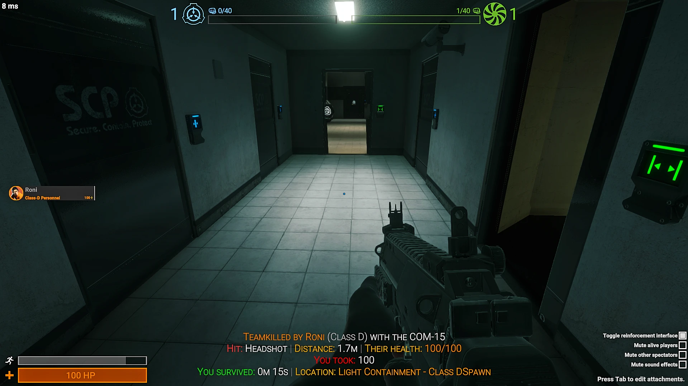
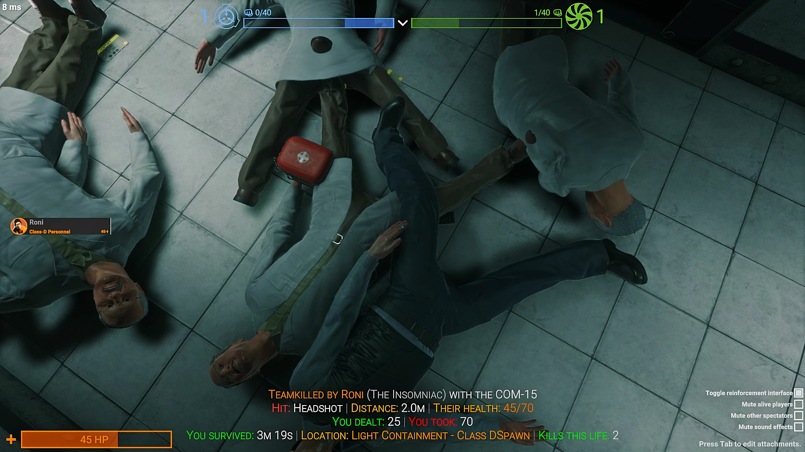

# DeathRecap

An [EXILED](https://github.com/ExMod-Team/EXILED) plugin for SCP: Secret Laboratory that shows a player a recap of their death once they enter spectator.

[](https://github.com/Storption/DeathRecap/releases/latest)
[](https://github.com/Storption/DeathRecap/releases/latest)
[](https://join.storption.com)

## How it works

When a player dies, they're shown what killed them, worded for the kind of death:

- **Killed by a player** - their name (in their role color), their role, the weapon, and where the shot landed (headshot, body, limb).
- **Killed by an SCP or zombie** - "Killed by SCP-049", with the player's name in brackets.
- **Killed by a teammate** - called out as a teamkill.
- **Killed by the environment** - falls, the Tesla gate, decontamination, the warhead, bleeding, poison and so on.
- **Custom deaths** - scripted or plugin-made deaths show their own death text.

Beneath that it can show the distance of the killing blow, how much damage you dealt to your killer, the killer's remaining health, and everything that hurt you - "You took 100: Alex 60, Sam 32, Bleeding 8" - plus how long you survived, where you died, and your kills that life. Every line can be switched off, reworded or renamed.

Damage counts everything that was actually absorbed, including Hume Shield and artificial health.

By default, the recap stays on screen for as long as the player remains spectating that life - it disappears the moment they respawn or the round ends. This can be changed to auto-hide after a fixed number of seconds instead, via config.

**Custom roles** - if a player has a custom role, the recap can show its name instead of the base role's. It reads EXILED's `UniqueRole` (set by EXILED CustomRoles), asks UncomplicatedCustomRoles if it's installed, and can optionally read the name from a player's custom info (used by SER and some other plugins). With no custom role plugin installed, nothing changes.

**Auto-update** - checks this plugin's own GitHub repo for a newer release, and if found, downloads it, verifies it against the release's SHA-256, and applies it. If restarting is enabled, players are told in-game and the server restarts once the round ends.

## Requirements

- [EXILED](https://github.com/ExMod-Team/EXILED) 9.14.2 or later

## Installation

1. Download the latest `DeathRecap.dll` from the [Releases](https://github.com/Storption/DeathRecap/releases) page.
2. Place it in your server's EXILED plugins folder (`%AppData%\EXILED\Plugins` on Windows `.config\EXILED\Plugins` on Linux).
3. Restart your server. A default config will be generated on first load.

## Config

```yaml
# Whether the plugin is enabled.
is_enabled: true
# Whether debug messages are shown.
debug: false
# How long, in seconds, the recap stays visible. 0 means it stays until the player leaves spectator or the round ends.
recap_duration_seconds: 0
# How many blank lines to pad the recap hint with, controlling its vertical position on screen.
hint_line_padding: 15
# The recap text's size, as a percentage of the default hint size.
hint_text_size_percent: 80
# How the detail lines under the recap's first line are arranged, one entry per line. List what goes on each line, separated by commas: hit, distance, killer_health, damage_dealt, damage_taken, survival, location, kills. Anything switched off elsewhere in this config is skipped, and a line with nothing to show is left out.
recap_layout:
- hit, distance, killer_health
- damage_dealt, damage_taken
- survival, location, kills
# Whether a recap is shown when nobody killed the player (falls, the Tesla gate, the warhead, scripted deaths and so on).
show_environmental_deaths: true
# Whether where a firearm hit landed (headshot, body shot, limb shot) is shown.
show_hit_location: true
# Whether the distance of the killing blow is shown.
show_distance: true
# Whether the killer's remaining health is shown.
show_killer_health: true
# Whether the damage the player dealt to their killer is shown.
show_damage_dealt: true
# Whether the damage the player took, and from whom or what, is shown.
show_damage_taken: true
# How many damage sources are listed before the rest are summarized as '+N more'.
max_breakdown_entries: 3
# Whether how long the player survived that life is shown.
show_survival_time: true
# Whether where the player died is shown.
show_location: true
# Whether the room is shown alongside the zone in the location line.
show_room: true
# Whether the number of kills the player got that life is shown. Not shown if they had none.
show_kills_this_life: true
# Whether roles added by custom role plugins are shown by their own name instead of their base role's.
custom_role_names_enabled: true
# Whether UncomplicatedCustomRoles, if installed, is asked for a player's role name.
custom_role_names_from_ucr: true
# Whether a custom role's name may be read from the player's custom info when it replaces the normal role display (used by SER and some other plugins). Off by default because other plugins can use custom info for other things - turn it on if you use SER custom roles.
custom_role_names_from_custom_info: false
# Whether to check for and automatically install updates.
auto_update_enabled: true
# Whether to keep a backup of the previous .dll before replacing it with an update.
auto_update_backup: true
# Whether to automatically restart the server once the current round ends, to apply a downloaded update. Never restarts mid-round.
auto_update_restart: true
```

The recap's wording is configurable via the generated translation file: every line's layout, and the names shown for each weapon, cause of death, role, zone and hit location.

## Showcase

<details>
<summary>Standard recap</summary>

The killer's health, hit location, distance and everything that hurt you:



</details>

<details>
<summary>Works with custom roles</summary>

Here the killer has a UCR custom role, so the recap shows its own name ("The Insomniac") instead of the base role's, with the location, survival time and kills switched on:



</details>